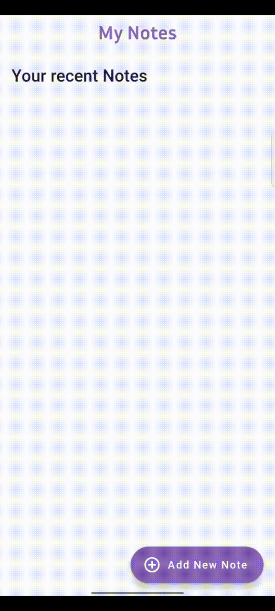
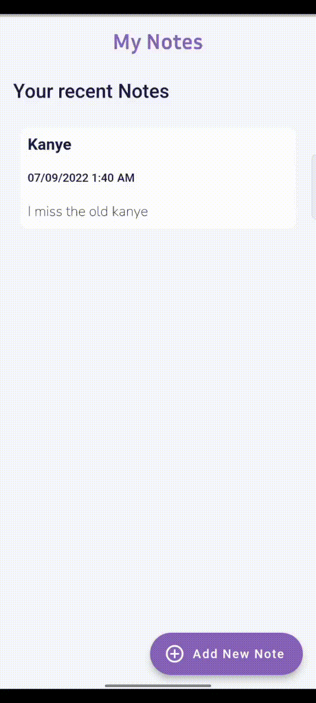
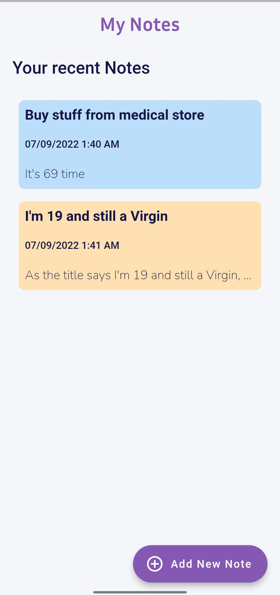

  

 
 

 
  Visitor count  
  

## About me

I'm [Darshan](https://drive.google.com/file/d/1Gd_8f76WtEBsWLhbIltxfH-leE8USUu2/view?usp=share_link) Flutter and Web Dev.
Contributes packages and extensions to some frameworks.

_GitHub Streaks >> Snapchat Streaks_

##

<h3 align="left">Socials</h3>

##

<h3 align="left">Skills and Tools</h3>

                <a href="https://sass-lang.com" target="_blank" rel="noreferrer"> 

##

<h2 align="center">Some of my Projects and Publications</h2>

##

##

<h4 align="left">Opportunes</h4>

&nbsp;&nbsp;&nbsp;  &nbsp;&nbsp;&nbsp;

&nbsp;&nbsp;&nbsp;
&nbsp;&nbsp;&nbsp;

##

<a href="https://pub.dev/packages/pretty_textfield" target="_blank"><h4 align="left">Pretty Text Field</h4></a>

&nbsp;&nbsp;&nbsp;  &nbsp;&nbsp;&nbsp;

##

<a href="https://pub.dev/packages/network_image_search" target="_blank"><h4 align="left">Network Image Search</h4></a>

&nbsp;&nbsp;&nbsp;  &nbsp;&nbsp;&nbsp;

&nbsp;&nbsp;&nbsp;  &nbsp;&nbsp;&nbsp;

<a href="https://github.com/darshn-n/ieee_index" target="_blank"><h4 align="left">Notex</h4></a>

&nbsp;&nbsp;&nbsp;
&nbsp;&nbsp;&nbsp;
&nbsp;&nbsp;&nbsp;

##

<h3 align="center">◾  Web Dev</h3>

<a href="https://github.com/darshn-n/flip-shop" target="_blank"><h4 align="left">Flip-Shop</h4></a>

&nbsp;&nbsp;&nbsp;

&nbsp;&nbsp;&nbsp;

##

<a href="https://github.com/darshn-n/ieee_index" target="_blank"><h4 align="left">IEEE-INDEX</h4></a>

&nbsp;&nbsp;&nbsp;

&nbsp;&nbsp;&nbsp;
&nbsp;&nbsp;&nbsp;

##
